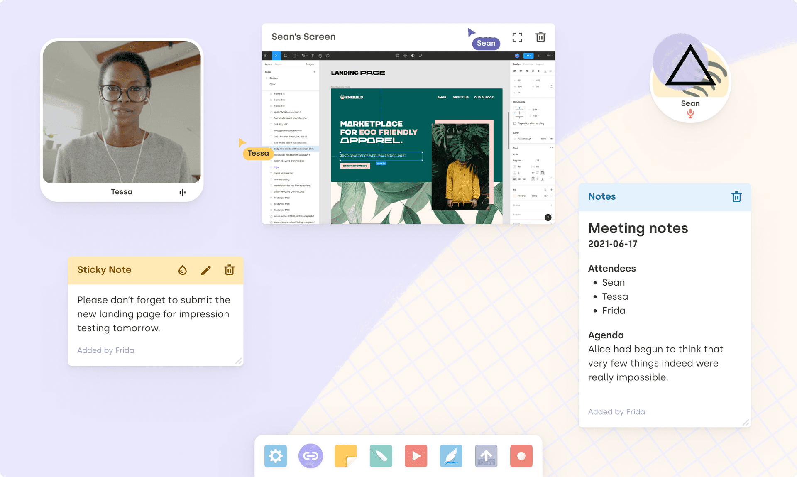

# PopSpace, virtual spaces for everybody.

PopSpace is the open source virtual canvas platform for chatting, collaborating, and playing.

Create your own spaces, on your own terms.

Learn more at [PopSpace](https://popspace.io)




# Quick Start

To install PopSpace you will need:

- An Audio/Video media provider:
  - A deployed [LiveKit server](https://livekit.io/)
  - A LiveKit Cloud account
  - Or, a Twilio account
---

## Using the Docker Image (Recommended)

To skip building the image yourself, use our published image:

```
docker pull ghcr.io/with-labs/popspace:latest
```

## Environment Variables

The following environment variables are required to run PopSpace in a Docker container or running locally. This assumes a persistent volume is mounted at `/data`:

```
# if you use LiveKit, define the following vars
REACT_APP_LIVEKIT_ENDPOINT=https://your-livekit-instance.com
LIVEKIT_API_KEY=<your livekit server key>
LIVEKIT_SECRET_KEY=<your livekit server secret key>
# if you use Twilio, define these instead.
# TWILIO_ACCOUNT_SID
# TWILIO_API_KEY_SECRET
# TWILIO_API_KEY_SID

# yes, these have different formats, sorry...
# NOTE: connection_limit=1 is vital for DATABASE_URL!!
DATABASE_URL=file:/data/db.sqlite?connection_limit=1
UNICORN_DATABASE_URL=/data/unicorn.sqlite
USER_FILES_DIRECTORY=/data/user-files
WALLPAPERS_DIRECTORY=/data/wallpapers
PUBLIC_URL=http://localhost:8889
```

You can put these in a `.env` file and run `docker run -env-file .env ...` to include them.

## Ports

The Docker image will need the following ports exposed to run the various services:

  * 8888: the UI server
  * 8889: the API server
  * 8890: the socket server
  * 8891: the collaborative document server

The UI connects to each of these services on the corresponding port for the host it is being served from. For example, if you're running the container on localhost, the UI will try to connect to `localhost:8889` for the API. If you host the container elsewhere on `https://popspace.myserver.com`, it will try to connect to `https://popspace.myserver.com:8889` for the API.

If you would like to modify how the app tries to connect to services, the relevant file is `noodle/src/api/services.ts`.

# Optional configuration

The rest of this configuration is optional. Popspace works without it.

## S3 Setup

Using S3 for user files is optional. By default, all uploaded files are stored in the filesystem.

You'll need 2 S3 buckets to run the app, one for wallpapers and one for user file uploads.

Currently the user file upload bucket needs public access. There's currently no configuration to setup a separate host origin for user files, so you can't put them behind a CDN and restrict access. The user file upload system uses older uploading code, whereas the newer wallpapers feature relies on the file upload library that also lives in this repo and supports CloudFront or other custom serving origins.

Bucket setup must allow CORS access from the origin you use to host the app. That will depend on your own hosting! You should also review the policies and configurations below carefully and determine if you can adopt a more strict policy for your usage.

### Wallpaper bucket setup

- We recommend setting up a CloudFront distribution for the bucket and restricting object access to the CloudFront origin access identity.
- You can use the following policy to setup CORS access for all origins, or be more specific and specify the origins you are using to host the app:

```
[
    {
        "AllowedHeaders": [
            "Authorization"
        ],
        "AllowedMethods": [
            "GET",
            "HEAD"
        ],
        "AllowedOrigins": [
            "*"
        ],
        "ExposeHeaders": [],
        "MaxAgeSeconds": 3000
    }
]
```

### User File bucket setup

- Unfortunately this bucket requires public access for all objects

```
{
    "Version": "2012-10-17",
    "Id": "Policy1604614964751",
    "Statement": [
        {
            "Sid": "Stmt1604614962916",
            "Effect": "Allow",
            "Principal": "*",
            "Action": "s3:GetObject",
            "Resource": "arn:aws:s3:::<YOUR BUCKET NAME>/*"
        }
    ]
}
```

- CORS access must be configured to allow PUT requests in order to upload files using presigned URLs.

```
[
    {
        "AllowedHeaders": [
            "*"
        ],
        "AllowedMethods": [
            "GET",
            "PUT"
        ],
        "AllowedOrigins": [
            "*"
        ],
        "ExposeHeaders": []
    }
]
```

### Adding environment variables

Finally, you'll need to provide environment variables to start using your S3 buckets for file storage instead of the filesystem:

```
# you need an S3 bucket for storing uploaded wallpapers
WALLPAPER_FILES_BUCKET_NAME
# you can set a custom origin for a wallpaper CDN (use this to
# setup CloudFront for example). If not, set this to
# `https://${WALLPAPER_FILES_BUCKET_NAME}.s3.amazonaws.com`
WALLPAPER_FILES_ORIGIN
# you need an S3 bucket for storing uploaded user files.
# this one doesn't use custom origin.
USER_FILES_BUCKET_NAME
# your AWS config and credentials
AWS_REGION
AWS_ACCESS_KEY_ID
AWS_SECRET_ACCESS_KEY
```

## Becoming an Admin

The only privilege admins have currently is to create and modify room templates. If that's not necessary (for example, you ran the seed command to setup default templates), you don't need to worry about this.

You can set your own actor up as an admin after connecting to the app. After you connect the first time, your actor connection info is cached in your browser, so the actor you use should remain stable until you clear cache or change browsers.

You can determine your actor ID by opening the console while the app is open and printing `client.actor.actorId`. To become an admin, access your database and flip the `admin` column to `true` for your actor. There's no other way to do that currently if you don't have direct database access.


## TLS support

It's probably easiest to terminate TLS outside the container, like at a load balancer level or in a Kubernetes service. But if your hosting is easier to manage by specifying a certificate to the app's services directly, you can do that by mounting your TLS files in the container and providing environment variables `SSL_PRIVATE_KEY_PATH` and `SSL_CERTIFICATE_PATH` to the container.

These are used by all the backend servers to set up TLS.

## The services

The app has several backend services.

### The UI

The UI server is a simple SPA Express server which hosts the files generated via Create React App in the `./noodle` source directory.

### The API

Source in `./noodle-api`. This is the HTTP server. HTTP requests are used for a few things like creating rooms, joining media calls, and uploading files.

### The Socket Server

Called 'hermes' internally, its source is in `./hermes`. Clients connect to this server via websocket. Events are passed from the client for all kinds of user actions, and then the server broadcasts response events to all peers to keep them synchronized.

The message protocol is not well-documented, but you can find a full list of incoming and outgoing message types in `./noodle/src/api/roomState/types/socketProtocol`. The backend handlers for these messages are located in `./hermes/src/server/processors`.

Having a separate server for HTTP and Socket connections is probably overkill for a self-hosted app! As PopSpace's usage moves in this direction, it might be welcome to combine these two services by moving the HTTP routes into the Hermes Express server.

### The Collaborative Document Server

Called 'unicorn' internally, its source is in `./unicorn/app`. It's essentially a thin wrapper around ShareDB to use a websocket transport, combined with a NextJS server to host an (unused) frontend for direct document editing.

The client utilizes the React component found in `./unicorn/component` to render collaborative document widgets which connect to this server.

### Other libraries

In addition to the backend services, there are a few internal libraries in use:

- `@withso/noodle-shared`: the shared library for managing some common business logic and database connections
- `@withso/file-upload`: an abstraction around user file management which includes image processing

In the current repo setup, these libraries are included as Yarn workspaces and are symlinked into the top-level `node_modules` to be referenced by other services.

## Local building

To build the Docker image yourself, you need to first build all the app services and libraries:

```
# install dependencies
yarn install
# build source files for all app services
yarn precontainerize
```

Then build the Docker image:

```
docker build -t popspace .
```

## Local development

First, build some dependencies by reusing the containerization preparation script:

```
# install dependencies
yarn install
# build source files for all app services
yarn precontainerize
```

To run services locally, you can use the umbrella script from the root of the repo:

```
yarn dev
```

Or you can run each service individually - refer to the README in each service directory.
